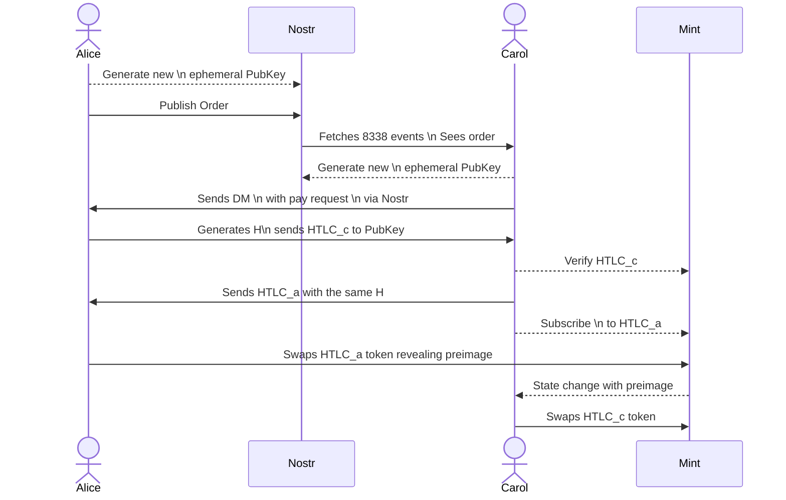

# Granola

Granola is a decentralized exchange layer on top of Cashu. It connects Cashu
wallets across mints and coordinates atomic swaps over Nostr. Nostr carries
public orders and private coordination; Cashu mints issue and settle the ecash.
Granola adds no custodian or additional settlement party.

> **Status:** testnet proof of concept. Use Testnut only; do not use real funds.

## Protocol flow

The same hash links both Cashu legs. One participant claims the first leg and
reveals the preimage; the counterparty uses that preimage to claim the second
leg. Nostr is the rendezvous and coordination layer, not a transaction ledger.



The diagram compresses the mint side into one participant. A settlement may
use one mint or two; in the cross-mint case, each leg is verified against its
own mint and keyset. The protocol's recovery path is bounded by the negotiated
locktimes and refund conditions.

## Testnet wallet

The static wallet runs entirely in the browser with `@cashu/cashu-ts`. It can
mint Testnut `sat` and `usd` tokens, receive encoded Cashu tokens, show
balances by unit and mint, download explicit bearer backups, and expose the same
operations to agents through `window.granola`.

The page also verifies and displays a public, issuer-specific SAT/USD Nostr
order book with an exchange-style best bid, best ask, and spread. Test makers
can sign and publish exact-rational limit orders through the UI or agent API.

```bash
npm ci
npm test
npm run dev
```

Open `http://localhost:5173/`. One page supports both sides of the exchange:
publishing an order creates an ephemeral maker role for that order, while
taking an order creates an ephemeral taker session. The same browser wallet can
hold both roles concurrently without a reload. The optional `?wallet=<name>`
query is only a local storage namespace for isolated test fixtures; it does not
select a maker or taker role. Follow the
[manual shared-page testnet tutorial](docs/guides/manual-testnet-swap.md) to
reproduce the demonstrated swap. The
[agent API](docs/guides/agent-api.md) documents exact amounts, trust prompts,
and the methods that can return bearer material.

Production builds use `npm run build` and write the static site to `dist/`.

## What the protocol treats as authoritative

- Public Nostr events advertise orders and support rendezvous; they do not
  contain proofs, preimages, private keys, or other spendable bearer material.
- Private Nostr messages bind the reservation, settlement terms, mint/keyset
  identities, expiry, and transcript so a message cannot be replayed in another
  session.
- Cashu mint observations decide whether each leg was accepted. A spent proof's
  verified witness supplies the shared preimage needed to claim the other leg.
- Fresh per-reservation keys and a bounded timeout/refund path contain peer
  disconnects and mint outages.

Atomic settlement still depends on the participating mints honestly enforcing
the advertised Cashu capabilities and remaining reachable during the settlement
and recovery windows. See the [security invariants](docs/protocol/security-invariants.md)
and [Cashu HTLC ADR](docs/adr/0004-cashu-htlc-settlement.md) for the exact
assumptions and failure boundaries.

## Documentation

- [Manual shared-page testnet swap](docs/guides/manual-testnet-swap.md)
- [Browser agent API](docs/guides/agent-api.md)
- [Testnet wallet notes](docs/guides/testnet-wallet.md)
- [Full documentation index](docs/README.md)
