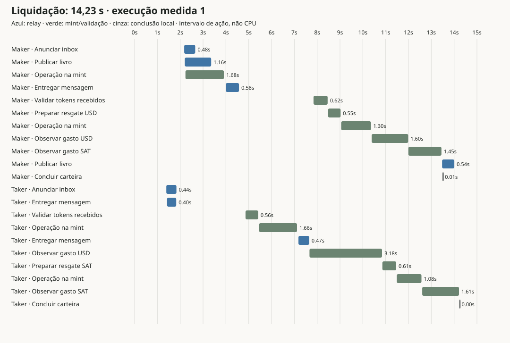

# Liquidação com rotas diretas e anúncios em paralelo — 2026-09-06

A mediana caiu de **17,69 s para 14,12 s**: **3,57 s a menos (20,2%)**.
A série foi repetida após a correção de concorrência `ae25679`; estes são os números
da versão final publicada. A mediana intermediária de 13,60 s não é usada como resultado final.
São três swaps reais em cada versão, com duas carteiras, Testnut SAT + Testnut
nofee USD e 20 segundos de navegação antes de publicar a ordem. A amostra é pequena;
as versões foram medidas em momentos diferentes, sem controle da latência dos
terceiros. O resultado mede o conjunto das mudanças, não o ganho isolado de cada uma.

Código: `ae25679`, asset `index-DR0O-JUR.js`. Baseline aquecido: `4e03e2e`,
asset `index-Db6e1jn6.js`. [Deploy validado](https://github.com/brenorb/granola/actions/runs/34054434279).

## Tempo percebido e requisições

O cronômetro começa no clique do taker e termina quando **ambas** as carteiras
mostram Filled. A navegação e a publicação inicial da ordem ficam fora desse
intervalo em ambas as versões. Compra/venda usam 20 SAT por 1 centavo de USD.

| Medida por swap | Baseline aquecido | Rotas diretas |
|---|---:|---:|
| Venda 1 | 16,781 s | 14,227 s |
| Compra 2 | 18,426 s | 13,772 s |
| Venda 3 | 17,686 s | 14,120 s |
| Mediana | 17,686 s | **14,120 s** |
| Aquisições de conexão já aquecida | 16 | 9 |
| Aquisições frias concluídas | 0–1 | **0** |
| Aquisições que falharam, inclusive livro público | 10–11 | 4 |
| Tempo agregado para obter conexões aquecidas | 8,2–8,8 ms | 0,6–1,2 ms |
| Consultas Nostr do livro, kind 30078 | 16–21 | 6 |
| Consultas Nostr de inbox, kind 10050 | 10 | 6 |
| Consultas privadas, kind 1059 | 3 | 2 |
| Requisições HTTP de metadata | 12 | 12 |
| POST de verificação de proofs | 10–11 | 10–11 |
| POST de swap na mint | 4 | 4 |
| POST de restore para recuperação idempotente | 4 | 4 |

As contagens são das operações observadas no intervalo, somando as duas carteiras.
OPTIONS de CORS estão separados nos dados e não contam como operações financeiras.
As consultas remanescentes incluem publicação/readback e atualização pública;
comunicar a rota elimina descoberta da contraparte, não todos os anúncios.
Aquisição de conexão é diferente de abrir um socket: reposição do pool continua
em segundo plano. Não interprete sockets de reposição como novos handshakes bloqueando
a liquidação.

## Onde o trabalho se sobrepõe

No primeiro swap, o maker publicou o estado reservado entre **2,200 e 3,357 s**,
enquanto a operação de bloqueio na mint ocorreu entre **2,229 e 3,912 s**.
O anúncio de inbox ocorreu entre **2,174 e 2,657 s**. Essas durações se sobrepõem.
A carteira maker concluiu em aproximadamente 13,50 s; a taker, em 14,23 s.
A publicação de Filled seguiu separada da conclusão financeira.

O teste de integração desconecta livro e descoberta, conclui financeiramente as duas
carteiras, recria os coordenadores e verifica a retomada dos anúncios persistidos.
Isso verifica a independência mesmo quando os anúncios demoram mais que a liquidação.

## Fronteiras externas e trabalho local

| União temporal dos intervalos — sem contar sobreposição duas vezes | Execução 1 | Execução 2 | Execução 3 |
|---|---:|---:|---:|
| HTTP de mint observado | 9,833 s | 9,680 s | 9,142 s |
| Espera por respostas Nostr observada | 3,308 s | 3,218 s | 3,384 s |
| Qualquer atividade de rede rastreada, incluindo WS/reposição | 13,001 s | 12,704 s | 12,548 s |
| IndexedDB | 0,305 s | 0,429 s | 0,454 s |

**Não some as linhas.** Rede, IndexedDB, processamento e as duas carteiras trabalham
em paralelo. A presença de uma requisição em andamento não demonstra que ela está
bloqueando a conclusão; há anúncios em segundo plano. HTTP inclui rede e CORS, não
somente processamento do servidor da mint. O tempo restante não é uma medida isolada
de CPU local, e não permite afirmar que toda demora agora é culpa dos terceiros.

As amostras de JavaScript do app + dependências registraram, respectivamente,
0,796/0,719 s, 0,659/0,852 s e 1,020/1,070 s nas duas carteiras. Esse trabalho também
se sobrepõe à rede. IndexedDB fez 398/390/384 operações, contra 375/367/376 antes:
a persistência do progresso assíncrono tem custo; não alegamos redução de armazenamento.

A geração e derivação das **três chaves** por carteira levou **7,9–17,3 ms** no
profiling; os anúncios de inbox da primeira execução levaram 443 e 483 ms. Por isso
mantivemos a separação de identidade por reserva da ADR 0003: remover consultas e
esperas não exige reutilizar a chave da ordem.

Ainda há espaço do nosso lado: preparar metadata antes do clique, reduzir releituras
do journal sem enfraquecer compare-and-swap, e investigar as observações de proofs
que usam fallback HTTP. Nenhuma dessas hipóteses está contada como ganho entregue.

## Validação

- 432 testes passaram; 7 ignorados. Typecheck e build isolado dos commits passaram;
  CI e deploy Pages também passaram.
- Cobertura inclui duas instâncias compartilhando armazenamento e apenas uma reserva
  vencedora; proofs copiadas entre instâncias independentes com uma rejeição da mint;
  resposta perdida com restore idempotente; desconexão e retomada dos anúncios;
  recusa autenticada, replay, expiração, troca de autor e regressão de revisão.
- Três swaps reais automatizados **pela interface**, venda/compra/venda: ambos Filled.
  Após recarregar: carteira A, 9.934 SAT + USD 0,03; B, 60 SAT + USD 99,97.
- Validação **manual pela interface**, em duas carteiras existentes e na versão
  publicada: **15,486 s**, ambos Filled, quatro notificações SPENT por WebSocket sob
  o CSP publicado. Após recarregar, cinco sessões Filled em cada carteira;
  maker com 9.890 SAT + USD 0,05, taker com 100 SAT + USD 99,95. O débito de 22 SAT
  corresponde a 20 SAT entregues mais a taxa da mint de teste.
- Concorrência real na versão final: duas abas do mesmo maker e dois takers
  clicando na mesma ordem. As duas abas terminaram com 9.978 SAT + USD 0,01 e
  uma sessão Filled. Um taker recebeu 20 SAT e ficou com USD 99,99; o recusado
  manteve USD 100,00 e terminou Frozen com recusa autenticada. Os mesmos saldos
  e estados foram verificados após recarregar as quatro páginas.
- A primeira tentativa com múltiplas abas expôs uma interface desatualizada numa
  aba que perdeu a corrida de checkpoints. A correção `ae25679` serializa cada
  ação por sessão usando Web Locks; a validação acima inclui essa correção.
- Evento público da ordem manual:
  `3cb0644d08bd476c07538ddc5d9c1fcacfa6a612da76035ead5cc26e8fcefd9d`;
  publicação inicial confirmada por três relays. Nenhum token, chave ou preimage
  está incluído nos artefatos.

[Dados agregados](2026-09-06-direct-routing-profile.json) e
[decisões de protocolo](../protocol/async-settlement.md).
