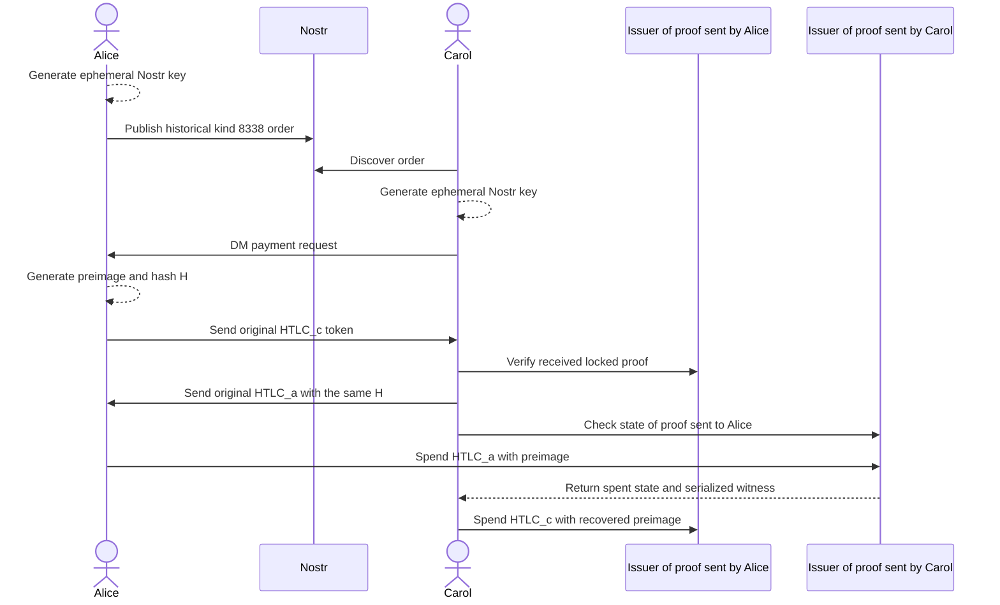

# Interpretive expansion of the 2024 Granola sequence

This is historical intent expanded into a two-mint view, not a normative or
verified protocol. The source calls the locked tokens `HTLC_c` and `HTLC_a`
without defining the suffixes and draws one generic mint despite describing a
cross-mint exchange. Splitting that actor into two proof issuers is an inference.
The labels below describe only who sent each proof; they do not assign ownership
of either mint or resolve the original `a`/`c` notation.

## What is known

- Nostr is coordination, not settlement.
- The parties intend to use the same hash across two Cashu trust domains.
- The second sender watches state before the first receiver spends.
- The last claim depends on learning the secret from the preceding claim.

## Current specification path

[NUT-14](https://github.com/cashubtc/nuts/blob/main/14.md) defines Cashu HTLC
spending conditions and states that an HTLC preimage can be retrieved through
[NUT-07](https://github.com/cashubtc/nuts/blob/main/07.md). NUT-07's optional
token-state response includes the serialized witness used to spend a proof.
NUT-14 therefore requires applications that depend on independent witness
retrieval to check the mint's info endpoint for NUT-07 support; applications
must likewise check that the mint supports the requested spending condition.

The protocol question is not whether a Cashu specification exists. It is
whether **both selected mints** advertise and correctly implement NUT-07 and
NUT-14, preserve the required witness, and return a preimage that matches the
committed hash under real two-mint testnet execution.

## What is not yet proven

- whether the received proofs can be validated for agreed amount, unit, mint,
  keyset, lock conditions, and unspent state before committing the other leg;
- how either party recovers when a peer or mint disappears;
- exact timeout/refund semantics and safe clock boundaries;
- how messages bind the order, reservation, negotiated terms, and transcript;
- whether HTLCs or the thesis's adaptor-signature construction will be used;
- which Nostr event kind replaces or formalizes historical kind `8338`.

Until those questions have ADRs, test vectors, and a real two-mint testnet
transcript, Granola is a research protocol rather than a working atomic swap.
